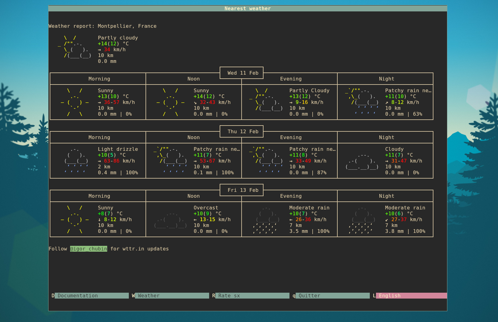

<div align="center">
    <h1>
        
    </h1>
</div>

## Overview

termfolio renders ANSI content on multiple pages. Pages are driven by a YAML
configuration file that defines languages and layers (each layer maps a key to a
command that outputs ANSI content).

## User guide

### Install without cloning

```bash
go install github.com/badele/termfolio@latest

# OPTIONAL 
go install github.com/badele/splitans@latest
```

### Install from the repository

```bash
git clone https://github.com/badele/termfolio.git
cd termfolio
go build ./cmd/termfolio

# OPTIONAL 
go install github.com/badele/splitans@latest
```

You can also install the binary into your GOPATH with:

```bash
# go env GOPATH
go install ./cmd/termfolio

# OPTIONAL 
go install github.com/badele/splitans@latest
```

### Run

The config path is required. The application will not look for default files.

```bash
./termfolio --config termfolio.yaml

# Optional: choose the initial language
./termfolio --config termfolio.yaml --lang en
```

Default language is `fr` when `--lang` is omitted (fallback to the first
configured language if `fr` is not present).

Docker example (entrypoint: `termfolio --config /work/termfolio.yaml "$@"`):

```bash
docker run --rm -it \
  -v "$(pwd)/termfolio.yaml:/work/termfolio.yaml" \
  badele/termfolio \
  -- config /work/termfolio.yaml \
  --lang fr
```



## Configuration

The YAML file defines languages and layers. Each layer has:

- `key`: single key used to switch to the layer
- `label`: per-language label shown in the footer
- `title`: per-language title shown in the header
- `help`: per-language help line shown under the menu
- `cmd`: per-language shell command to produce ANSI output

Example:

```yaml
langs:
  - code: fr
    label: Français
  - code: en
    label: English

layers:
  - key: "D"
    label:
      fr: "Documentation"
      en: "Documentation"
    title:
      fr: "Documentation termfolio"
      en: "Termfolio Documentation"
    help:
      fr: "\x1b[34mAide: \x1b[37mCe caractère \x1b[0m\x1b[33m »  \x1b[0m\x1b[37mindique un lien hypertexte\x1b[0m"
      en: "\x1b[34mAide: \x1b[37mThis character \x1b[0m\x1b[33m »  \x1b[0m\x1b[37mindicate a hyperlink\x1b[0m"
    cmd:
      fr: "splitans -f neotex -F ansi docs/documentation-fr.neo"
      en: "splitans -f neotex -F ansi docs/documentation-en.neo"
  - key: "W"
    label:
      fr: "Météo"
      en: "Weather"
    title:
      fr: "Méteo la plus proche"
      en: "Nearest weather"
    cmd:
      fr: "sh -c 'set -euo pipefail; curl --fail -s --max-time 1 https://wttr.in/ | splitans -F ansi -W 104 || splitans -f neotex -F ansi docs/weather.neo'"
  - key: "R"
    label:
      fr: "Rate sx"
    title:
      fr: "Rate sx"
    cmd:
      fr: "sh -c 'set -euo pipefail; curl --fail -s --max-time 1 https://eur.rate.sx/ | splitans -F ansi -W 104 || splitans -f neotex -F ansi docs/ratesx.neo'"
```

Notes:

- Commands are executed with `sh -c`, so any shell pipeline can be used.

## Keys

- `q` or `ctrl+c`: quit
- `L`: cycle language (when `langs` is provided)
- layer keys: switch to a layer (defined in `layers[].key`)
- arrow keys / scroll: move in the viewport (when content overflows)

## Development and contribution

See `CONTRIBUTING.md` for contribution details.
